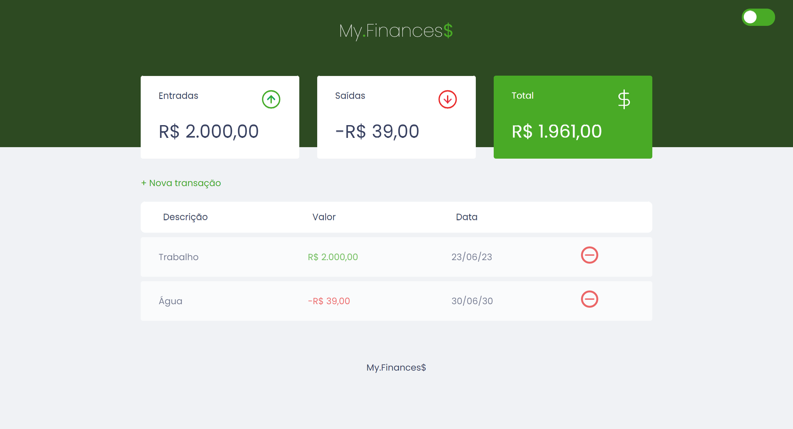

# My.finances

  <a href="#-tecnologias">Tecnologias</a>&nbsp;&nbsp;&nbsp;|&nbsp;&nbsp;&nbsp;
  <a href="#-projeto">Projeto</a>&nbsp;&nbsp;&nbsp;|&nbsp;&nbsp;&nbsp;
  <a href="#-licença">Licença</a>

<h1 align="center">
    
</h1>

 

## 🧪 Tecnologias

Esse projeto foi desenvolvido com as seguintes tecnologias: 

- [HTML5]
- [CSS3]
- [JavaScript]

## 💻 Projeto

My.finances é um aplicativo de controle financeiro pessoal, onde você pode registrar e excluir transações e visualizar o saldo de entrada e saída.

## 📝 License

Esse projeto está sob a licença MIT. Veja o arquivo [LICENSE](LICENSE.md) para mais detalhes.

---